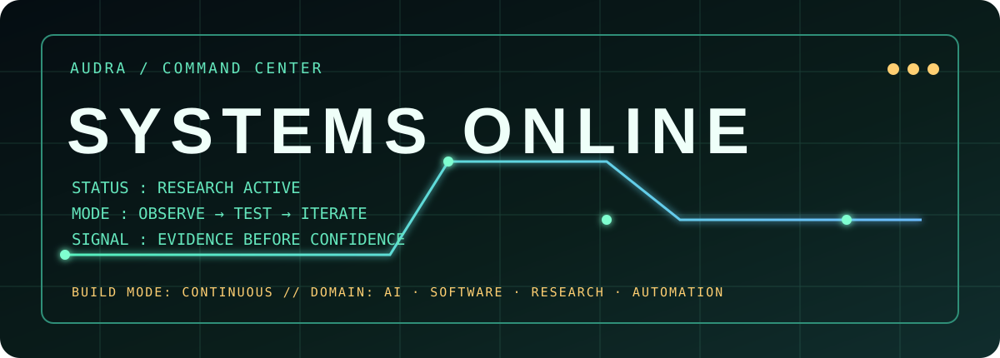
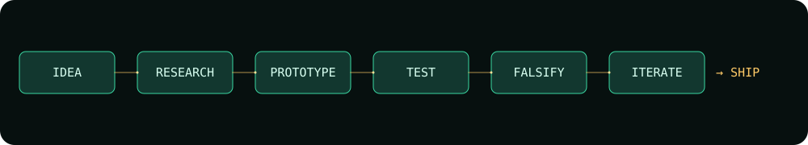
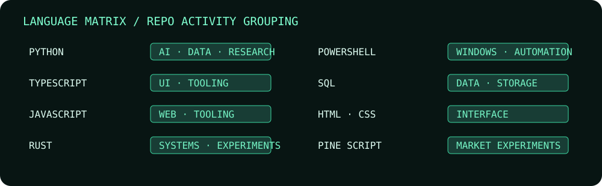
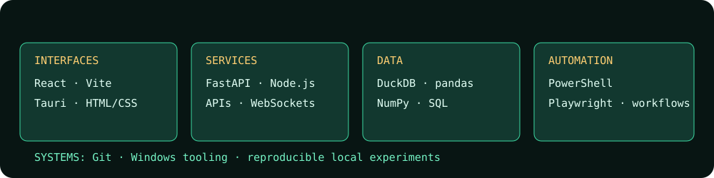
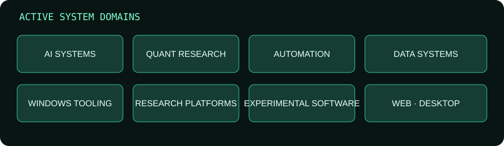
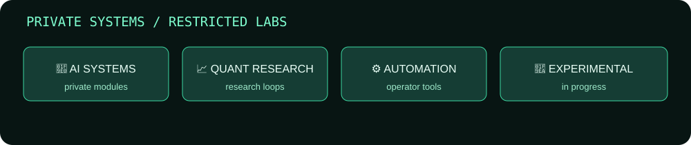
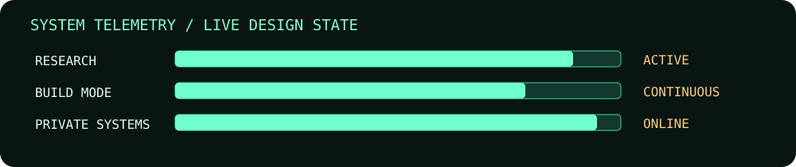

# 🛰️ AUDRA / COMMAND CENTER



```text
SYSTEMS ONLINE  ·  RESEARCH ACTIVE  ·  BUILD MODE: CONTINUOUS
MODE: OBSERVE → TEST → ITERATE     SIGNAL: EVIDENCE BEFORE CONFIDENCE
```

## Mission console

I build research-heavy software that makes complex systems easier to observe,
test, and improve. The work moves across AI systems, quantitative
experimentation, automation, data infrastructure, and focused web/desktop
interfaces.

> Observe before optimizing. Evidence before confidence.



## Language matrix



The labels above describe observed repository activity groupings, not skill
percentages or proficiency claims.

## Toolchain / ecosystem



## Active system domains



## Private systems / restricted labs

Most of the interesting work is private by design. Public-safe categories are
enough to show the direction without exposing repository names, URLs, source,
branches, or internal architecture:



## Current focus

- AI and model infrastructure experiments
- Quantitative research and simulation workflows
- Automation and Windows-native tooling
- Data lineage, validation, and reproducible research loops
- Interfaces that make system state legible

## Engineering doctrine

```text
[01] RESEARCH BEFORE IMPLEMENTATION
[02] KEEP THE LINEAGE
[03] MAKE FAILURE USEFUL
[04] AUTOMATE WHAT SHOULD BE REPEATABLE
[05] SHIP THE SMALLEST HONEST INTERFACE
```

## System telemetry



GitHub's native contribution surface remains the activity source of truth. No
third-party stats, streaks, trophy cards, or dynamic counters are embedded.



<p align="center"><sub>AUDRA // END TRANSMISSION</sub></p>
